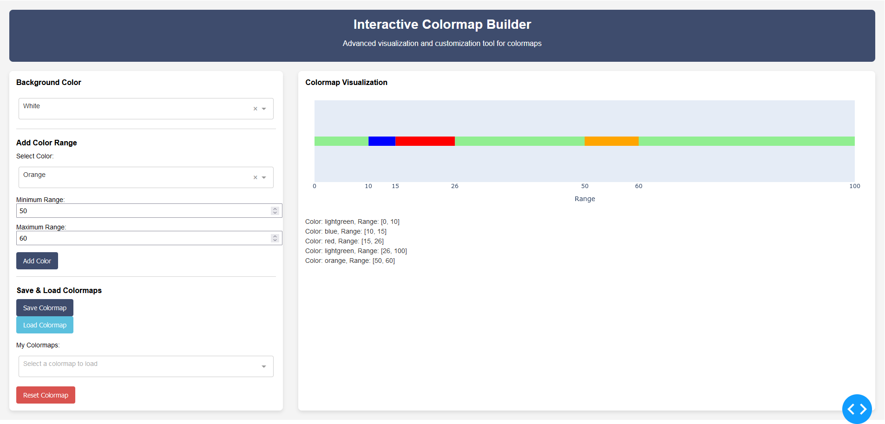

# Interactive Colormap Builder



An interactive web application built with [Dash](https://dash.plotly.com/) and [Plotly](https://plotly.com/python/) that allows users to create and visualize custom colormaps dynamically.

## Features

- **Default Colormap**: Starts with a white colormap from 0 to 100.
- **Add Custom Colors**:
  - Select a color from a predefined list.
  - Define the range (minimum and maximum) for the selected color.
- **Real-time Visualization**:
  - The colormap updates dynamically as new colors are added.
  - Overlapping ranges are handled intelligently:
    - Overlapping colors are adjusted to maintain non-overlapping ranges.
    - White remains the default color for any unused intervals.
- **Dynamic Labels**:
  - Transitions between color ranges are displayed as tick labels on the colormap axis.
- **Color Info Display**:
  - A detailed list of all added colors and their respective ranges is displayed below the colormap.

## Installation

1. Clone the repository:
   ```bash
   git clone https://github.com/yourusername/interactive-colormap-builder.git
   cd interactive-colormap-builder
   ```

2. Install the dependencies:
   ```bash
   pip install -r requirements.txt
   ```

## Usage

1. Run the application:
   ```bash
   python app.py
   ```

2. Open a browser and navigate to:
   ```
   http://127.0.0.1:8050/
   ```

3. Start customizing your colormap by:
   - Selecting a color.
   - Specifying its range.
   - Clicking "Add Color" to update the colormap.

## File Structure

```
.
├── app.py               # Initializes the Dash app and runs the server
├── layout.py            # Defines the layout of the app
├── callback.py          # Contains the callback logic for interactivity
├── README.md            # Project documentation
├── requirements.txt     # Python dependencies
├── images/
│   └── screenshot.png   # Screenshot of the application
```

## Requirements

- Python 3.7+
- Dash
- Plotly

To install all required Python libraries, run:
```bash
pip install -r requirements.txt
```

## Example Usage


In the example above:
1. The initial colormap is white from 0 to 100.
2. A blue color is added for the range `[20, 40]`.
3. A green color is added for the range `[5, 35]`.
   - Blue is updated to `[35, 40]` to avoid overlap.
   - White fills the remaining intervals.

## Contributing

Contributions are welcome! Please feel free to submit issues or pull requests.

## License

This project is licensed under the [MIT License](LICENSE).
